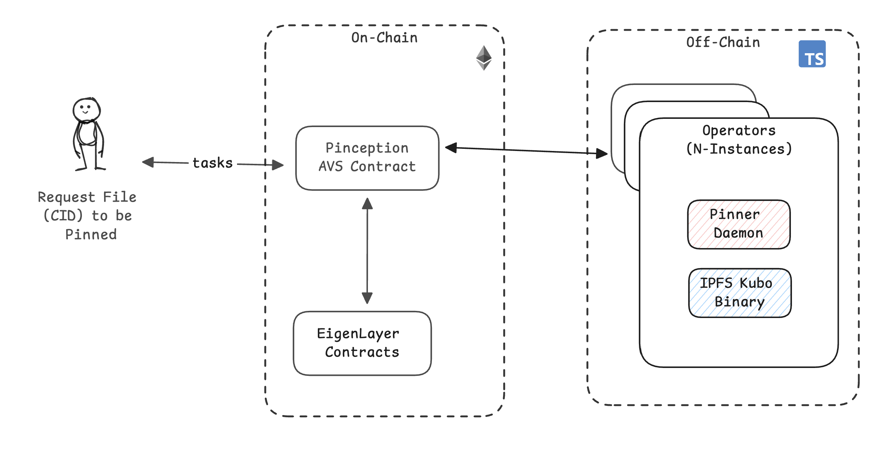

<p align="center">
  <a href="https://github.com/wesfloyd/pinception">
    
  </a>
</p>

<h1 align="center">Pinception</h1>
<h3 align="center">Decentralized IPFS Pinning Service Built on EigenLayer</h2>

# Project Goals
- Build an AVS in the open, via community, that enables decentralized, crypto incentivized "[IPFS](ipfs.tech) Pinning as a Service" (AVS) on [EigenLayer](https://docs.eigenlayer.xyz/eigenlayer/overview). 
- Background and inspiration [here](https://x.com/DennisonBertram/status/1772621874192584962).
- Interested in roadmap and following our progress? Join the discussions [here](https://github.com/wesfloyd/pinception/discussions).

# Demo Video

[Decentralize Your dApp’s Secret Off Chain Backend w/EigenLayer](https://www.youtube.com/watch?v=_rWdJZkJYVw) (End of this talk at [15m44s](https://youtu.be/_rWdJZkJYVw?si=8K0D4iworyjwnPxw&t=944))

<p align="center">

</p>

# Why Pinception?
- IPFS is great ✅
- IPFS is p2p (w/o incentives) 🤷
- Self-hosting an IPFS server not great 👎
- Existing IPFS pinning services require centralized hosting infra 😬


# Roadmap
See Discussion for ongoing sprint tracking.

# Demos

Manual Demo: see integration-tests/demo-manual-full.sh

Semi-Automated Demo:
- Terminal 1: ./integration-tests/start-anvil-sandbox.sh
- Terminal 2: ./operator/start-operator
- Terminal 3: ./run-integration-test1.sh


# Local Devnet Deployment


The following instructions explain how to manually deploy the AVS from scratch including EigenLayer and AVS specific contracts using Foundry (forge) to a local anvil chain, and start Typescript Operator application and tasks.

Install dependencies:

- [Node](https://nodejs.org/en/download/)
- [Typescript](https://www.typescriptlang.org/download)
- [ts-node](https://www.npmjs.com/package/ts-node)
- [tcs](https://www.npmjs.com/package/tcs#installation)
- [npm](https://docs.npmjs.com/downloading-and-installing-node-js-and-npm)
- [Foundry](https://getfoundry.sh/)
- [ethers](https://www.npmjs.com/package/ethers)

### Start Anvil Chain

In terminal window #1, execute the following commands:

```sh

# Install npm packages
npm install

# Start local anvil chain
npm run start:anvil
```

### Deploy Contracts and Start Operator

Open a separate terminal window #2, execute the following commands

```sh
# Setup .env file
cp .env.example .env
cp contracts/.env.example contracts/.env

# Updates dependencies if necessary and builds the contracts 
npm run build

# Deploy the EigenLayer contracts
npm run deploy:core

# Deploy the Hello World AVS contracts
npm run deploy:hello-world

# (Optional) Update ABIs
npm run extract:abis

# Start the Operator application
npm run start:operator

```

### Create Hello-World-AVS Tasks

Open a separate terminal window #3, execute the following commands

```sh
# Start the createNewTasks application 
npm run start:traffic
```